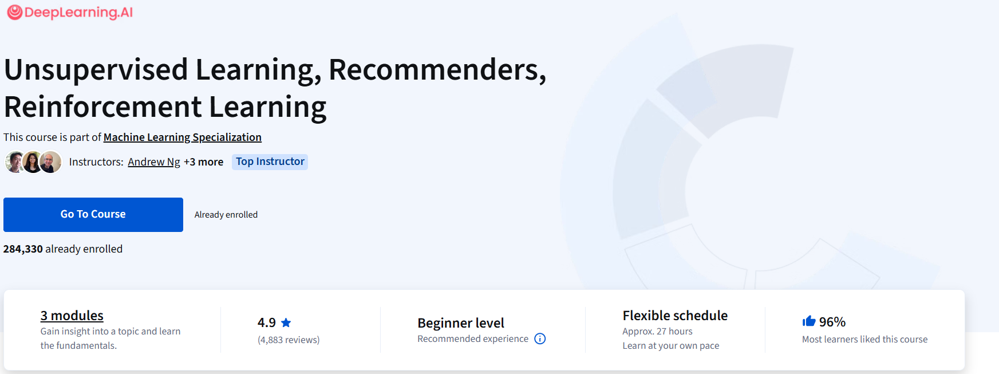

## Unsupervised Learning, Recommenders, Reinforcement Learning

在机器学习专项课程的第三部分中，你将：

- 运用无监督学习技术解决无监督学习问题，包括聚类和异常检测。
- 采用协同过滤方法和基于内容的深度学习方法构建推荐系统。
- 构建深度强化学习模型。

该机器学习专项课程是由 DeepLearning.AI 与斯坦福在线联合打造的基础性在线项目。在这个对初学者友好的项目中，你将学习机器学习的基础知识，以及如何运用这些技术构建真实世界的人工智能应用。